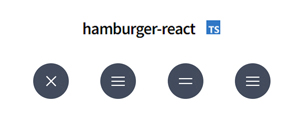

<h1>Laceys Farm Shop & Butchers</h1>

  
<a href="#home">Home</a> 
<a href="#about">About</a> 
<a href="#frontEnd">Front End</a> 
<a href="#backEnd">Back End</a> 
<a href="#hooksAndLibraries">Hooks & Libraries</a> 
<a href="#seo">SEO</a> 
<a href="#takeAways">Take Aways</a> 

<!-- ABOUT -->

<!-- FRONT END -->
<a href="#home">Home</a> 

    

Front end is engineered on NEXT JS and hosted with Vercel.
 

<!-- BACK END -->
<a href="#home">Home</a> 

    Back end is based on NEXT JS pages/api. The actual database is running from raspberry pi on my desk.
    

<!-- HOOKS & LIBRARIES -->
<a href="#home">Home</a> 

<!-- SEO -->
<a href="#home">Home</a> 

<!-- TAKE AWAYS: -->
<a href="#home">Home</a> 

<!-- QUICK LINKS: -->
<a href="#home">Home</a> 
<a href="#about">About</a> 
<a href="#frontEnd">Front End</a> 
<a href="#backEnd">Back End</a> 
<a href="#hooksAndLibraries">Hooks & Libraries</a> 
<a href="#seo">SEO</a> 
<a href="#takeAways">Take Aways</a> 

