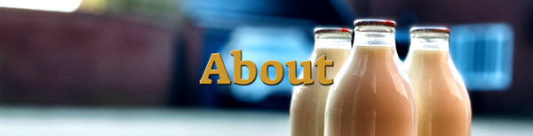
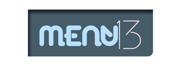

<h1>Laceys Farm Shop & Butchers</h1>

  
<!-- <h2>Quick Links</h2> -->
<a href="#home">Home</a> 
<a href="#about">About</a> 
<a href="#frontEnd">Front End</a> 
<a href="#backEnd">Back End</a> 
<a href="#hooksAndLibraries">Hooks & Libraries</a> 
<a href="#seo">SEO</a> 
<a href="#takeAways">Take Aways</a> 

  
<!-- ABOUT -->

<!-- <h2>About</h2> -->

I was lucky to work with The Lacey family to help them promote their business and keep updated with customers. The site had a responsive feature included and was visually improved. We also worked together to create their product photography.

<!-- FRONT END -->
  
<!-- <a href="#home">Home</a>  -->

<!-- <h2>Front End</h2> -->

Original website from 2014 was created in html and css. Version on this repository is re-created in NEXT JS and hosted with Vercel.
 

<!-- BACK END -->
  
<!-- <a href="#home">Home</a>  -->

<!-- <h2>Back End</h2> -->

    Back end is based on NEXT JS pages/api. The actual database is running from raspberry pi on my desk.
    

<!-- HOOKS & LIBRARIES -->
  
<!-- <a href="#home">Home</a>  -->

<!-- <h2>Hooks & Libraries</h2> -->

 

<!-- PHOTOGRAPHY -->
  
<!-- <a href="#home">Home</a>  -->

<!-- <h2>Photography</h2> -->

We created series of photographs of The Lacey Farm produce, mainly focusing on the dairy section with farming theme.

<!-- SEO -->
  
<!-- <a href="#home">Home</a>  -->

<!-- <h2>SEO</h2> -->

Pages were planned so anyone looking for milk delivery, farm shop, local produce or local butcher in Buckinghamshire or Slough would have Lacey Farm pages in the search results.

<!-- TAKE AWAYS: -->
  
<!-- <a href="#home">Home</a>  -->

<!-- <h2>Take Aways</h2> -->

In this project I connected front and back end at 0 cost by hosting front end with Vercel and for back end utilising my old Raspberry Pi.
  
One issue I had to deal with was working out how to keep public ip to our home router updated so the front end can connect anytime, even after BT has changed our IP. I solved that by creating next js repository on github linked to vercel. Then I set up a cron job on the Raspberry Pi to run every minute of the day, to check for our IP using ifconfig.me/ip link. Result from this check was directed to a file in NEXT JS app and finished it all with git add . && git commit -m 'updated' && git push command in the cron job.

<!-- RECOMMENDATION: -->
  
<!-- <a href="#home">Home</a>  -->

<!-- <h2>Recommendation:</h2> -->
<i>
Lucy worked with our business in years 2014-2016 to help redesign and relaunch our website.  I found her very professional, and understanding of our requirements.  She was easy to work with and we were happy with the outcome of the project.

</i>

Will Lacey

<!-- QUICK LINKS: -->
<!-- <h2>Quick Links</h2> -->
  
<a href="#home">Home</a> 
<a href="#about">About</a> 
<a href="#frontEnd">Front End</a> 
<a href="#backEnd">Back End</a> 
<a href="#hooksAndLibraries">Hooks & Libraries</a> 
<a href="#seo">SEO</a> 
<a href="#takeAways">Take Aways</a> 

